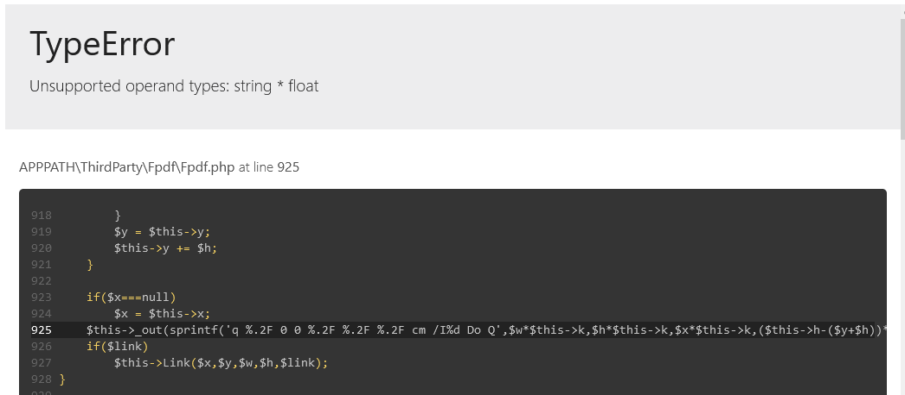

# Versión 3.0.1

En la versión 3.0.1 se corrigió la generación del reporte de ventas y kardex.

## Problemas corregidos

---

* [Generación del reporte de ventas](#reporte-de-ventas)
* [Generación de kardex de producto](#kardex)

### Reporte de ventas

Al generar el reporte de ventas puede mostrar la pantalla en blaco o mostrar el siguiente error:



Para coregir este error abrimos el archivo `app/ThirdParty/Fpdf/PlantillaVentas.php`

Identificamos la linea donde agregamos la imagen para el logotipo (originalmente está en la linea 20).

```$this->Image($dato['logo'], 10, 5, 15, 'PNG');```

Agregamos el parametro `0` antes de `'PNG'`

```$this->Image($dato['logo'], 10, 5, 15, 0, 'PNG');```

### Kardex

Al generar el kardex del productos puede mostrar la pantalla en blaco o mostrar el siguiente error:


Para coregir este error abrimos el archivo `app/ThirdParty/Fpdf/PlantillaKardex.php`

Identificamos la linea donde agregamos la imagen para el logotipo (originalmente está en la linea 26).

```$this->Image($dato['logo'], 10, 5, 15, 'PNG');```

Agregamos el parametro `0` antes de `'PNG'`

```$this->Image($dato['logo'], 10, 5, 15, 0, 'PNG');```
